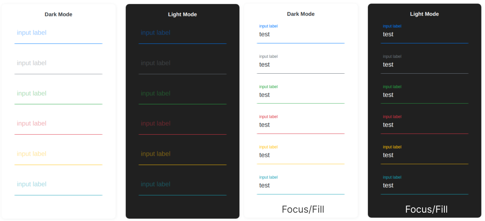
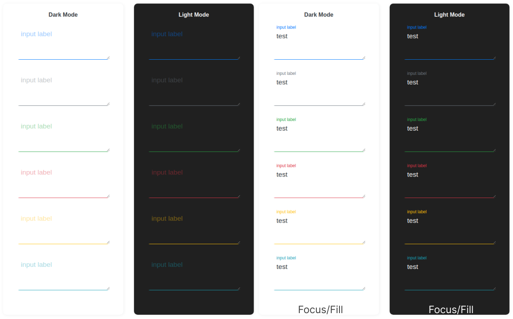
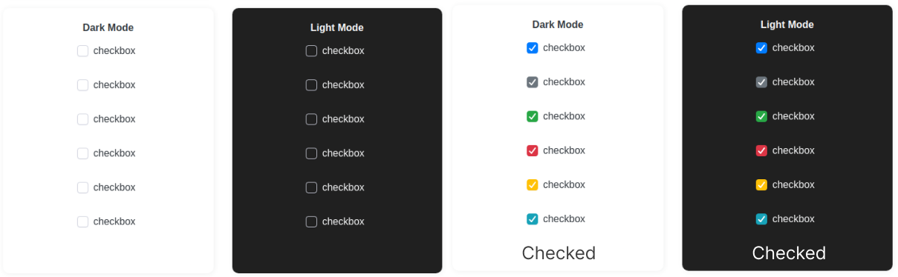
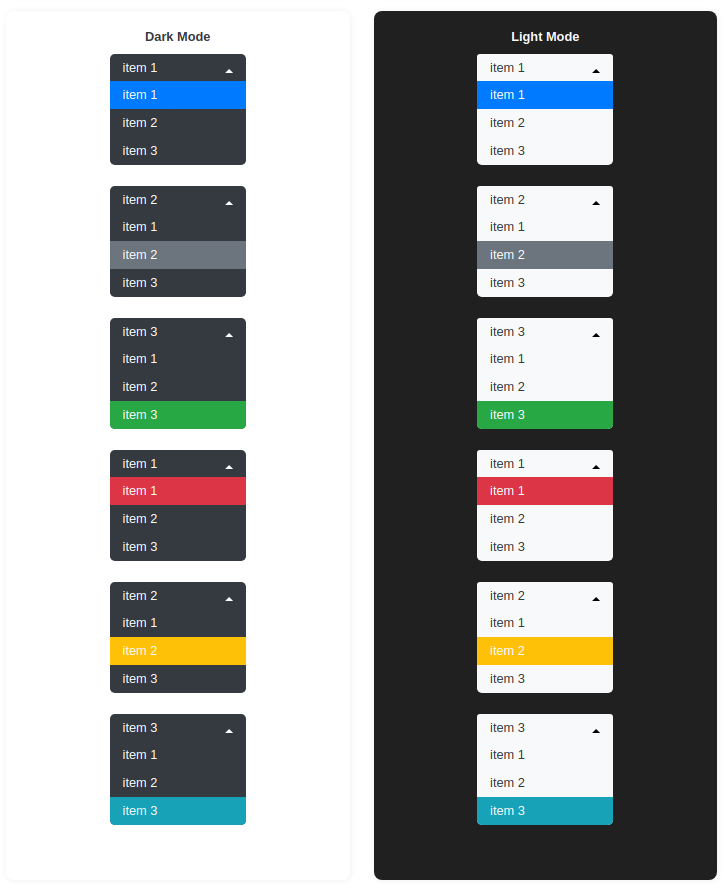
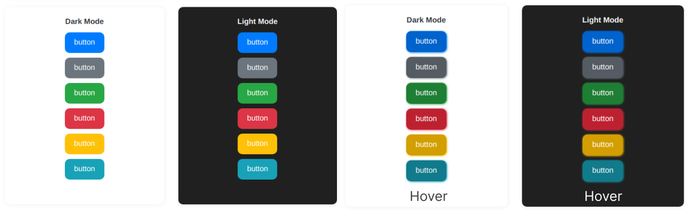
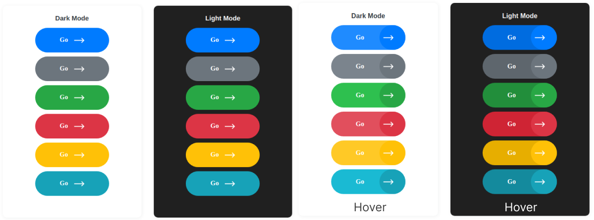

# Form elements

It's a vue form element package.

### IMPORTANT

After installation you have to import selected css files.
```js
import 'bootstrap/dist/css/bootstrap.css'
import 'bootstrap-vue/dist/bootstrap-vue.css'
```

## Input


### Props

| Name | Description     | type | default | required |
| :-------- | :------- | :-----| :---- | -- |
| label | input label text | String | - | true |
| required | if true append * to the beginning of input element | Boolean | false | false |
| value | input value | String | - | false |
| theme | input theme | String | light | false |
| variant | input color | String | primary | false |

### Usage
```html
<template>
<k-input label="test" theme="dark" variant="danger"/>
</template>
<script>
import { KInput } from "@kozmonos/form-elements";

export default {
	components: { KInput }
}
</script>
```

## Textarea


### Props

| Name | Description     | type | default | required |
| :-------- | :------- | :-----| :---- | -- |
| label | textarea label text | String | - | true |
| required | if true append * to the beginning of textarea element | Boolean | false | false |
| value | textarea value | String | - | false |
| theme | textarea theme | String | light | false |
| variant | textarea color | String | primary | false |

### Usage
```html
<template>
<k-textarea label="test" theme="dark" variant="danger"/>
</template>
<script>
import { KTextarea } from "@kozmonos/form-elements";

export default {
	components: { KTextarea }
}
</script>
```

## Checkbox



### Props

| Name | Description     | type | default | required |
| :-------- | :------- | :-----| :---- | -- |
| value | checkbox value | String | - | false |
| theme | checkbox theme | String | dark | false |
| variant | checkbox color | String | primary | false |

### Usage

```html
<template>
<k-checkbox :value="true" theme="dark" variant="danger"/>
</template>
<script>
import { KCheckbox } from "@kozmonos/form-elements";

export default {
	components: { KCheckbox }
}
</script>
```

## Select


### Props

| Name | Description     | type | default | required |
| :-------- | :------- | :-----| :---- | -- |
| value | select value | String | null | false |
| options | select options | Array | - | true |
| theme | select theme | String | dark | false |
| variant | select color | String | primary | false |

### Usage

```html
<template>
<k-select :options="['item 1','item 2','item 3']" value="item 2" theme="dark" variant="danger"/>
</template>
<script>
import { KSelect } from "@kozmonos/form-elements";

export default {
	components: { KSelect }
}
</script>
```

## Button



### Props

| Name | Description     | type | default | required |
| :-------- | :------- | :-----| :---- | -- |
| variant | select color | String | primary | false |

### Usage

```html
<template>
<k-button variant="danger">button string</k-button>
</template>
<script>
import { KButton } from "@kozmonos/form-elements";

export default {
	components: { KButton }
}
</script>
```

## Go button


### Props

| Name | Description     | type | default | required |
| :-------- | :------- | :-----| :---- | -- |
| to | Href link | String | - | false |
| variant | select color | String | primary | false |
| theme | select theme | String | dark | false |

### Usage

```html
<template>
<k-go-button variant="danger">button string</k-go-button>
</template>
<script>
import { KGoButton } from "@kozmonos/form-elements";

export default {
	components: { KGoButton }
}
</script>
```